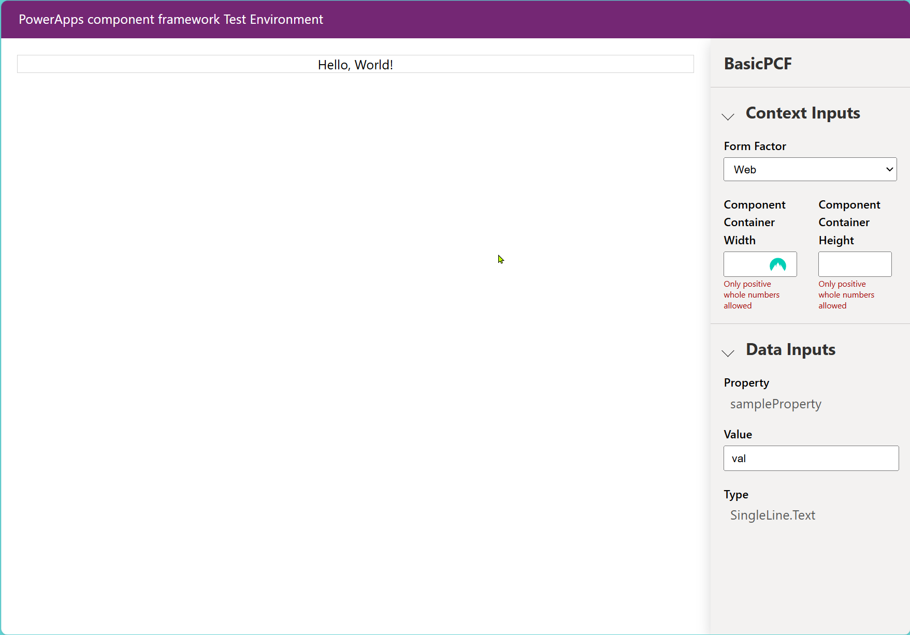

# BasicPCF
As basic as it gets

```
# Notes to walk you through all this
# https://workflowy.com/s/practical-walkthroug/9TjQngDeg46GK4Ul
#
# Create this file for your workspace
vscode.code-workspace

pac pcf init --namespace YOUR_NAMESPACE_HERE --name YOUR_PCF_COMPONENT_NAME --template field
#pac pcf init --namespace SuperPowerLabs --name BasicPCF --template field
# Another Example
# pac pcf init --namespace PCTroubleShooter --name basicPCF --template field

npm install

# Add this to the top of index.tx - line 4, right after the class definition
private _container: HTMLDivElement;
# And add this to the init function
this._container = container;
const helloDiv = document.createElement("div");
helloDiv.innerText = "Hello, World!";
this._container.appendChild(helloDiv);

# Time to run and play
npm run build
npm start

# Create a PowerShell script to build and deploy!
# deploy.ps1

$timestamp = (Get-Date).ToString('yyyy-MM-dd-hh-mm-ss-tt')
$simpleDir = "./SolutionPackages/PCF_COMPONENT_NAME"                # <-- REPLACE TOKEN! #️⃣ 
$finalDir = "./SolutionPackages/PCF_COMPONENT_NAME-$timestamp"      # <-- REPLACE TOKEN! #️⃣ 
New-Item -ItemType Directory -Path $simpleDir -Force
Push-Location $simpleDir
# #️⃣ REPLACE TOKENS! ⬇️
pac solution init --publisher-name "YOUR_PUBLISHER_NAME" --publisher-prefix "YOUR_PUBLISHER_PREFIX"
pac solution add-reference --path "../.."
Pop-Location
New-Item -ItemType Directory -Path $finalDir -Force
Move-Item -Path "$simpleDir/*" -Destination $finalDir
Remove-Item -Path $simpleDir -Force
msbuild /t:build /restore
# #️⃣ REPLACE TOKENS! ⬇️
pac auth create --environment "ENVIRONMENT_NAME"
# #️⃣ REPLACE TOKENS! ⬇️
pac pcf push --publisher-prefix YOUR_PUBLISHER_PREFIX

```




